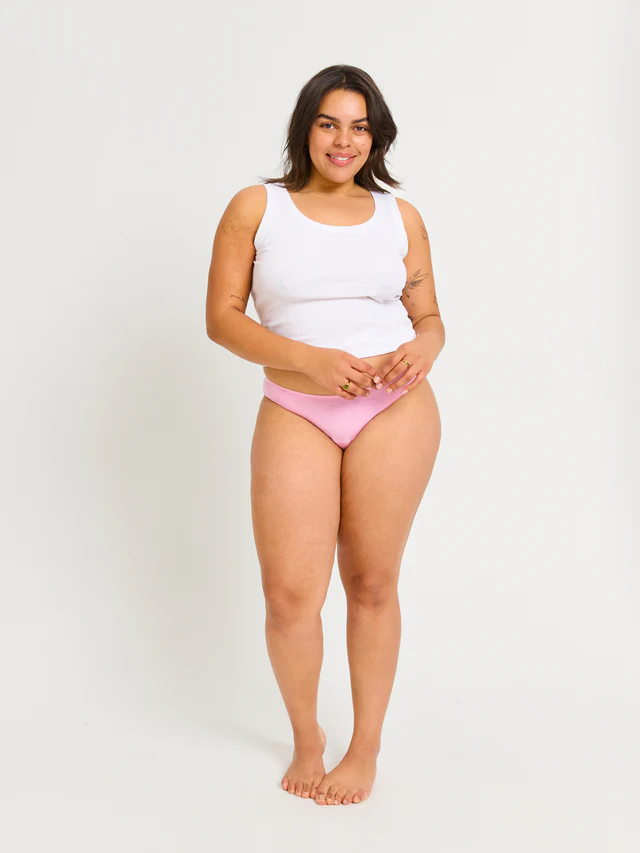
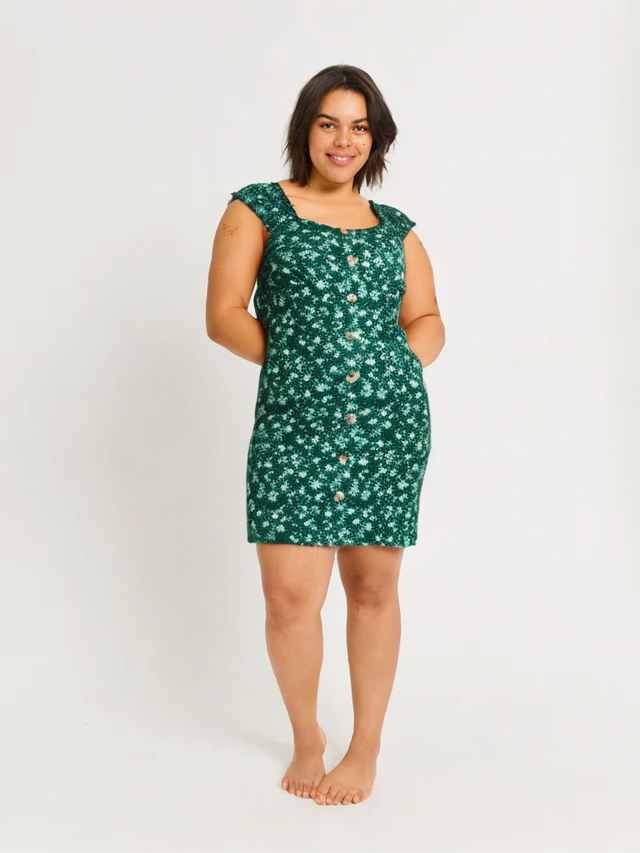
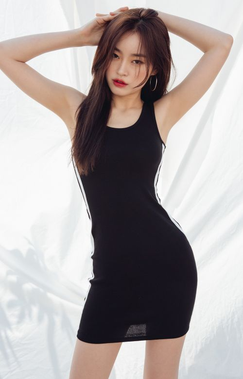
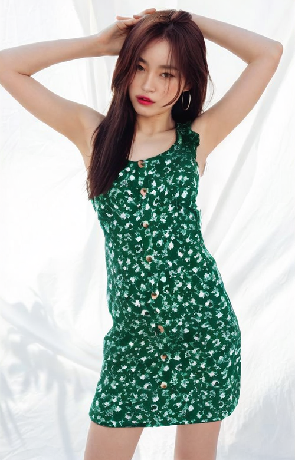
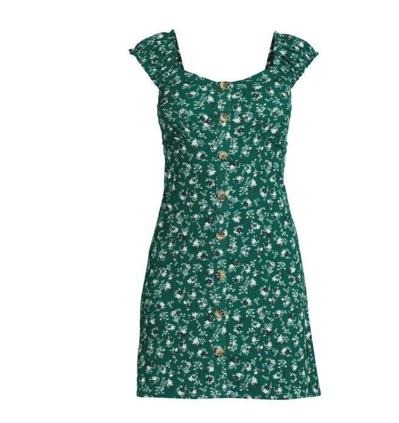
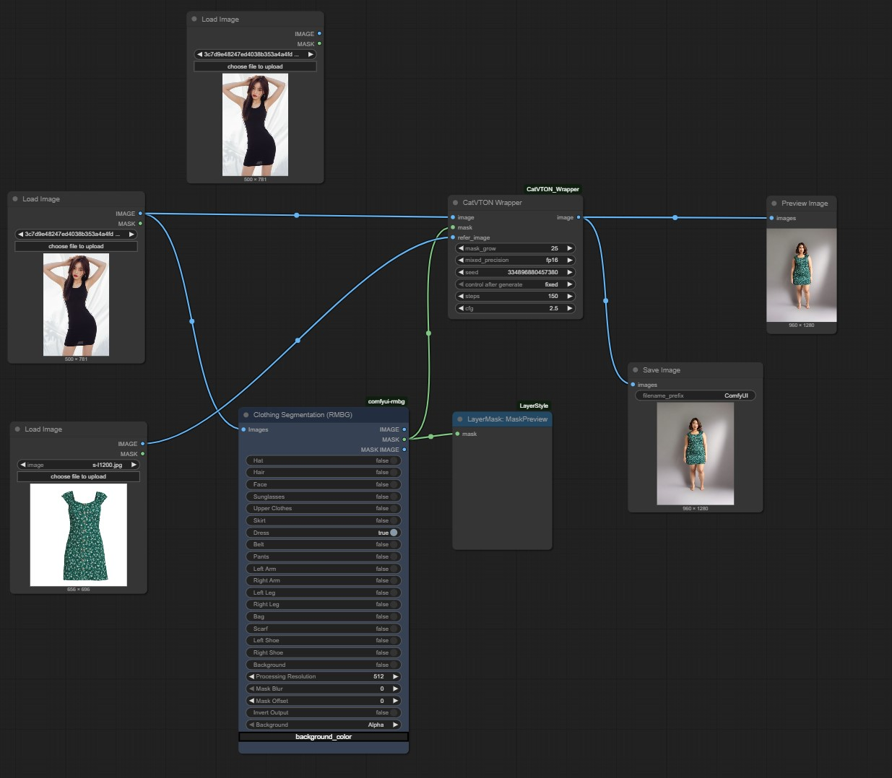

# Ai_VirtualFit

VirtualFitUI — это демо-проект по виртуальной примерке одной и той же одежды на людях с различными типами телосложения с использованием ComfyUI и CatVTON

### Пример 1: Плюс-сайз

| До | После |
|----|-------|
|  |  |

---

### Пример 2: Азиатская фигура

| До | После |
|----|-------|
|  |  

### Одежда

 
 
 

## DONE:
- Проведена сегментация изображения с помощью ClothesSegment.
- Использована маска для наложения новой одежды.
- Для замены одежды применён блок CatVTONWrapper.
- Сохранены изображения до и после, а также полный .json workflow.

## TODO:

- Сейчас не используется IPAdapter, ControlNet или OpenPose.

- Местами теряются детали платья (например, складки юбки или текстура).

- Это можно улучшить через качественный LoRA или настройку cfg / steps.

- Видны незначительные артефакты (особенно в зоне рук).

- Это можно улучшить более точной маской или использованием mask refinement модулей.

- Расширение до 4–5 различных фигур 

 
 
 

